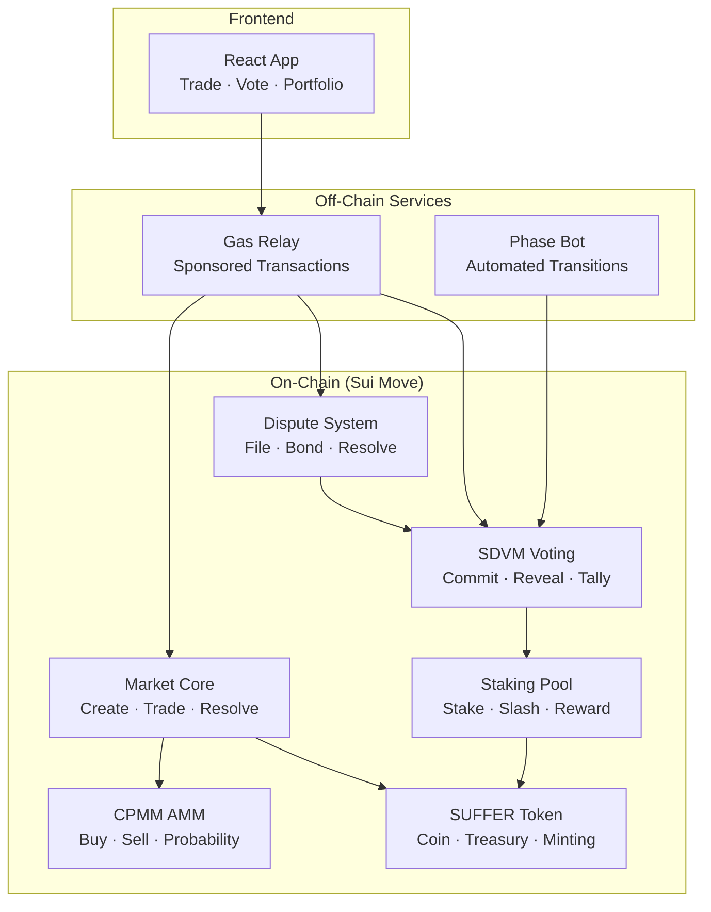

# Frontier Prediction Market

Community-built on-chain prediction market on Sui, powered by SUFFER (SFR) token. Create markets on game outcomes, trade shares via constant-product AMM, and resolve disputes through decentralized tokenholder voting. Built by a player, for players.

## Architecture



## Directory Structure

```
contracts/          Sui Move smart contracts (18 modules)
                   ├── suffer.move          Token, treasury, minting
                   ├── pm_market.move       Market lifecycle (create, close, resolve)
                   ├── pm_trading.move      CPMM AMM (buy, sell, claim, refund)
                   ├── pm_math.move         Pricing formulas (CPMM)
                   ├── pm_position.move     User position tracking
                   ├── pm_resolution.move   3-tier resolution system
                   ├── pm_dispute.move      Dispute filing & bond distribution
                   ├── pm_sdvm.move         Commit-reveal voting & tally
                   ├── pm_staking.move      Staking pool, slashing, cooldown
                   └── (9 more)             Config, registry, treasury, admin, events, etc.

frontend/           React + TypeScript trading interface
                   ├── src/                 Component code, state management
                   ├── src/demo/            Mock market data for demo mode
                   └── STYLEGUIDE.md        UI/UX specifications

gas-relay/          Sponsored transaction relay (users need no SUI)
                   ├── src/                 Express server, sponsorship logic
                   └── .env.example         Configuration template

phase-bot/          Automated voting phase transitions
                   ├── src/                 Phase advancement automation
                   └── .env.example         Configuration template

docs/               Architecture, specifications, operations
                   ├── PREDICTION_MARKET_ARCHITECTURE.md
                   ├── SDVM_ARCHITECTURE_PRINCIPLES.md
                   ├── SUFFER_DVM_SPEC_v2.md
                   ├── SDVM_TESTNET_RUNBOOK.md
                   └── (more)

tests/              Attack simulations and integration tests
```

## Quick Start

### Prerequisites

- [Sui CLI](https://docs.sui.io/build/install) (Move 2024 edition)
- [Node.js](https://nodejs.org/) 18+
- Sui testnet wallet with SUI tokens (for sponsorship, staking, bonding)

### 1. Frontend (Demo Mode)

Run the frontend with mock market data — no contract deployment needed.

```bash
cd frontend
npm install
npm run dev
# → localhost:5173
```

The frontend ships with mock market data for demo purposes. You'll see the full UI with sample markets, trading panels, dispute flows, and SDVM voting screens without needing to connect to an on-chain contract.

### 2. Gas Relay (Optional)

Sponsor transactions so users don't need SUI tokens for voting/staking.

```bash
cd gas-relay
cp .env.example .env
# Edit .env: set SPONSOR_KEYPAIR_B64 and PM_PACKAGE_ID
npm install
npm run dev
# → localhost:3001
```

### 3. Phase Bot (Optional)

Automate voting phase transitions (COMMIT → REVEAL → TALLY).

```bash
cd phase-bot
cp .env.example .env
# Edit .env: set BOT_KEYPAIR, PM_PACKAGE_ID, SUI_RPC_URL
npm install
npm run dev
```

### 4. Contracts

Build, test, and publish on-chain contracts.

```bash
cd contracts
sui move build
sui move test
sui client publish --gas-budget 500000000
# → Save the published package ID
```

## How It Works

**Four-Tier Resolution System:**

1. **Tier 1 — Deterministic:** On-chain data automatically resolves the outcome.
2. **Tier 2 — Declared Source:** A trusted verifier with special capability proposes and settles the outcome.
3. **Tier 3 — Creator Proposed + Community Fallback + SDVM Voting:**
   - Creator has 24-hour priority window to propose after market closes
   - If creator doesn't propose, anyone can propose (community resolution) after 24 hours by posting a bond equal to creation bond
   - Community proposer gets 50% of creator's bond as reward if correct
   - Tokenholders (stakers) vote via commit-reveal with Schelling point economics (slashing for wrong votes, rewards for correct)
4. **Tier 4 — Emergency Invalidation:** Multisig can override; returns all bonds.

**Trading & Resolution Flow:**

1. Creator posts market with title, outcomes, close time, and resolution terms.
2. Traders buy/sell outcome shares via constant-product AMM (supports binary and categorical markets). Prices reflect probability.
3. Market closes at scheduled time.
4. Creator or verifier proposes an outcome; if creator doesn't propose within 24h, community member can propose with bond
5. If no dispute filed within 24h, outcome finalizes; winners claim 1 SFR per share (minus settlement fee); correct proposer gets reward
6. If dispute filed, stakers vote (COMMIT 12h → REVEAL 12h → TALLY). Correct voters earn rewards. Wrong voters slashed 0.1% of stake. Non-reveals slashed 1%.

## Token Economics (SUFFER)

- **Supply:** 10M SFR (2 decimals)
- **Used for:**
  - **Trading:** Buy/sell outcome shares; fee 25 bps (0.25%)
  - **Bonding:** Creation bonds (10–2000 SFR) and dispute bonds (50–10,000 SFR)
  - **Staking:** Vote weight in SDVM disputes; earn rewards or lose to slashing
  - **Settlement:** Winners claim payouts minus 10 bps (0.1%) settlement fee

## Contributions Welcome

This is an open-source project. We welcome community improvements in these areas:

- **Multi-outcome categorical markets** — Expand testing for N>2 outcomes
- **Mobile responsive design** — Improve trading UI for mobile devices
- **Custom resolution sources** — Add support for additional data sources (APIs, oracles)
- **SDVM voting UI/UX** — Enhance staker experience during commit-reveal voting
- **Documentation** — Clarify architecture, add examples, improve runbooks
- **Tests** — Add integration tests, stress tests, attack simulations

See [CONTRIBUTING.md](CONTRIBUTING.md) for development setup and contribution guidelines.

### Training Wheels: God Levers

This system ships with admin override capabilities ("god levers") for testnet.
These are training wheels — explicitly temporary with documented removal criteria.
We actively seek collaboration on:

- **Decentralization path** — Help us define and implement the removal of admin overrides
- **Governance model** — Community-driven parameter changes post-lever-removal
- **Formal verification** — Move Prover analysis of CPMM invariants and slash/reward math
- **Economic modeling** — Simulation of voter participation under different slash/reward parameters

## Documentation

| Document | Purpose |
|----------|---------|
| [Architecture](docs/PREDICTION_MARKET_ARCHITECTURE.md) | Complete system overview — start here |
| [SDVM Deep-Dive](docs/SDVM_ARCHITECTURE_PRINCIPLES.md) | Voting mechanics, staking, dispute resolution |
| [Specification](docs/SUFFER_DVM_SPEC_v2.md) | Complete formal spec |
| [Testnet Runbook](docs/SDVM_TESTNET_RUNBOOK.md) | Deploy and operate on testnet |
| [Monitoring](docs/SDVM_MONITORING_CONFIG.md) | Metrics, alerts, dashboards |
| [Key Management](docs/SDVM_KEY_MANAGEMENT.md) | Wallet and security procedures |
| [Docs Index](docs/INDEX.md) | Full list of all documentation |

## Security

This is pre-mainnet software. Before deploying to mainnet:

- Conduct a professional security audit
- Test with realistic market sizes and voter participation
- Monitor testnet metrics for 3+ months
- Establish mainnet governance for parameter changes and god levers

See [SECURITY.md](SECURITY.md) for vulnerability reporting.

## License

MIT — see [LICENSE](LICENSE).

This is an independent community project. Not affiliated with or endorsed by CCP Games or any official entity.
